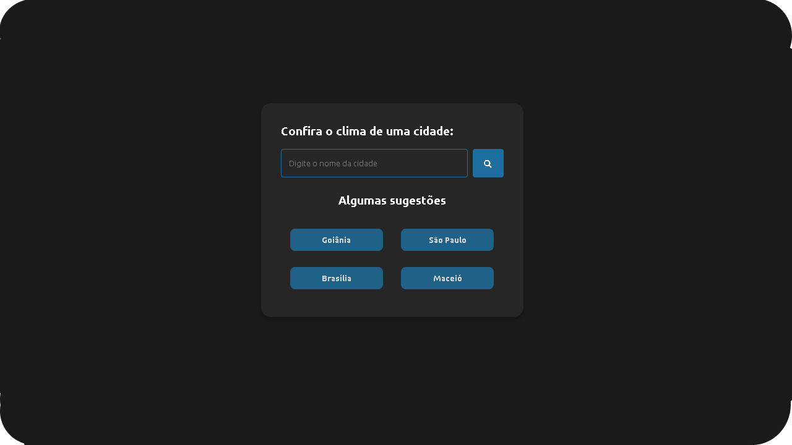

# weatherapp
<p>
  
</p>

# 🖥️ Weather App

Projeto de exibição do clima em cidades.


## 📙 Descrição

A aplicação permite que os usuários pesquisem e observem o clima das cidades pesquisadas.

## 🚀 Tecnologias Utilizadas

- ExpressJS (poderia ter feito so utilizando as tecnologias abaixo, porem, ja tinha a base crua do express no pc e resolvi usar ela rs)
- Html/Css/JavaScript

## 🖥️ Instalação

1. Clone o repositório:
   ```
   git clone https://github.com/lipesshw/weatherapp
   cd weatherapp/
   ```

2. Instale as dependências:
   ```
   npm install
   ```

3. E finalmente execute o projeto:
   ```
   npm run dev
   ```


